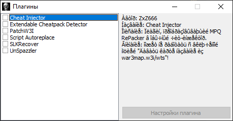
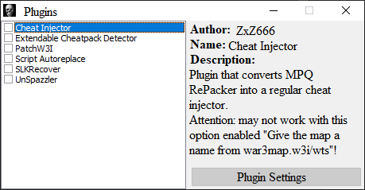
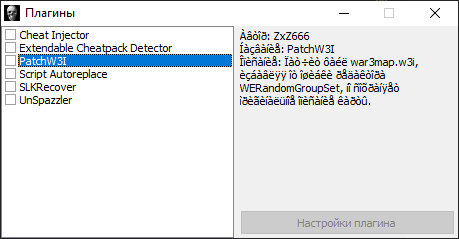
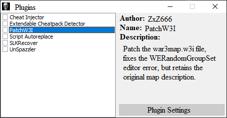
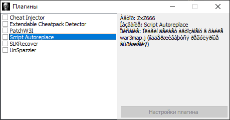
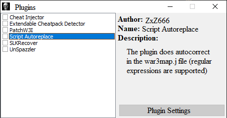
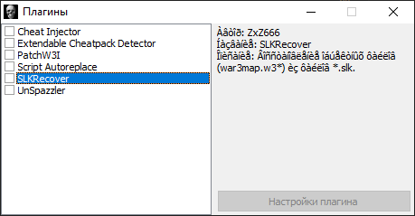
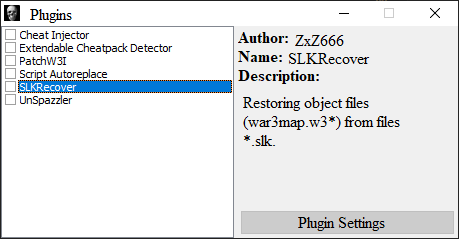
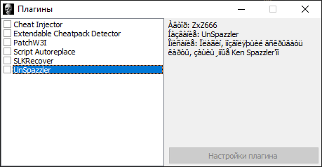
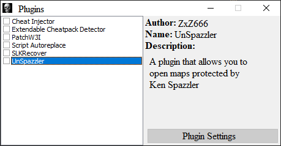

# MPQ RePacker - Program for reassembling Warcraft 3 maps.

## Features
- Inserting a cheat-pack
- Map optimization by deleting unused files
- Replacing the incorrect war3map.w3i and creating an empty war3mapUnits.doo
- Possibility to pack the map with X-Deprotect
- Full extensibility via plugins
- Random cheat activation chat command generation (double-click on the activator input field)
- All settings are saved (no need to set everything up again every time)
- 9 built-in cheat packs; you can add your own

## Execution
Run MPQRepacker.exe in Releases/version folder
Some anti-virus programs give warnings, this seems to be false and is probably safe to ignore. Please submit a pull request if you know how to fix it.

## Compiling
Open MPQRepacker.cbproj with C++ Builder 2010 (Newer versions of the IDE are not yet supported)

### Dependencies
- JEDI Code Library for 2010 http://cc.embarcadero.com/Download.aspx?id=27211
- JEDI Visual Component Library for 2010 http://cc.embarcadero.com/Download.aspx?id=27212
- FlexCompress for 2010 https://www.componentace.com/download/download.php?editionid=14
- ZipForge for 2010 https://www.componentace.com/download/download.php?editionid=12
- StormLib https://github.com/ladislav-zezula/StormLib

## Changelog

### 1.24:
1. Displaying the X-Deprotect window
2. Many additional settings: compression, analysis, etc
3. Fix: bug when closing
4. Fix: bug when packing files with StormLib
5. Fix: bug with extra files packing
6. Fix: *.SLK re-parsing bug

### 1.23:
1. Added help (F1 in the main window)
2. Added API function UnregisterOverride and the ability to call the plugin settings window
3. Files consisting of a single extension or without an extension are now also located
4. Added analysis of *.slk files
5. Added dynamic (GetProcAddress) API modules for C++ and Pascal to the example plugin sources
6. Added auto-entry of output map name
7. All plugins have been updated to be compatible with the new version, and they have also become compatible with all old versions

### 1.22:
- Russian paths in plugins fixed
- Now the maps in the list have the same name as in the description

## Plugin pack:
- SLKRecover is a simple MPQ RePacker plugin that uses the Silk Object Optimizer console program with the EXPORT_OBJECT_DATA = 1 option to recover war3map.w3* files from *.slk files. Thus, it is possible (for example) to recover data about units and abilities in DotA (tested on 6.72c).
- Extendable Cheatpack Detector is a plugin for detecting cheat packs in the map.
- UnSpazzler is a plugin that allows you to open maps protected by Ken Spazzler
- Script Autoreplace is a plugin for autoreplace in war3map.j, supports RegEx (regular expressions). Setup instructions: each line in the field on the left corresponds to the line in the input field on the right (left - what to find, right - what to replace); the special characters \r, \n, and \t can be used in both fields
- PatchW3I - patches the war3map.w3i file, getting rid of the WERandomGroupSet editor error, but retains the original map description.
- Cheat Injector is a plugin that converts MPQ RePacker into a regular cheat injector. Attention: it may not work with the "Give map a name from war3map.w3i/wts" option enabled (if it is disabled, the map name will be taken from the title of the original one).

# Instructions

## Map repacking
To repack the map, select the source map and enter the path to the result, then click "Rebuild Map".

	
## World Editor support
If you want to open the map in the World Editor (Warcraft III's default editor), then enable these options and repack the map:

	
## Using plugins
To install the plugin, you need to copy it (*.dll files) to the %APPDATA%\MPQ RePacker\Plugins\ folder (Hint: program settings and cheat packs are stored one level higher).
Enabling plugins in the program is very simple - just click the Plugins button and mark the required plugins.

## Creating plugins
To create plugins, you need to know any programming language in which you can write a DLL (Windows Dynamic Link Library), such as C, C ++, C #, Pascal.
It is possible to use several methods of working with the program:
- Breakpoints (to complement the work of the program)
- Overrides (search, unpack or pack files per program)
- StormLib / WinAPI function hooks
	
### API functions
- API functions allow plugins to interact with the program.
- API_GetAppDataPath - Returns the path to %APPDATA%\MPQ RePacker
- API_GetTempPath - returns the path to the temporary folder
- API_GetSourceMap - returns the path to the source map
- API_GetDestMap - returns the path to the final map
- API_WriteLog - writes a line to the log
- API_RegisterOverride - registers an override
- API_UnregisterOverride - unregister override (only if it is registered by the same plugin)
- API_GetFlagState - get option value
- API_SetFlagState - set option value
	
### Plugin code format (See Example Plugin)
Press F1 in the plugin selection window to open the archive with the sample plugin sources (C++) and API function modules for C++ and Pascal.